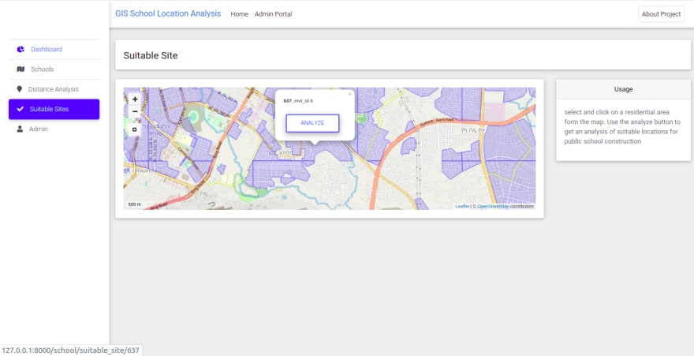

# Geo-Django Project to Analyze and Determine Potential Public School Locations in Addis Ababa

The objective of the project is to develop an internet-based tool that identifies suitable public school
locations in the city of Addis Ababa, taking to consideration these factors:

1. Availability of transportation from the residential areas to the proposed location
2. Proximity of the proposed location to the residential areas
3. The demography of the residential area for which the public school is to be constructed

The initial data about schools and residential areas was collected from openstreetmap. With the help
of the Overpass API, data from openstreetmap was extracted and stored in a PostgreSQL database
with a PostGIS extension.
Some unnecessary data was also eliminated form the database. Data without names and other
missing information were also removed.

[Read This Article for more detail](https://dev.to/eyuelberga/developing-an-internet-based-gis-application-to-analyze-and-determine-potentialpublic-school-locations-in-addis-ababa-2oko)

## Preview





## Running Locally

To run this project locally, the easiest way would be using `docker-compose`

```shell script
$ docker-compose up

```
You also need to provide some environment variables which you can find in the `.env.example` file

You can also run it using your locally installed python. Make sure you activate a virtual environment
and install all the required module in the `requirements.txt` file. 

## License

MIT © [Eyuel Berga Woldemichael](https://github.com/eyuelberga)
